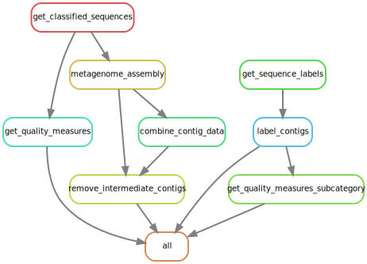

# Characterizing undetermined sequences from metagenomic sequencing
> Snakemake Workflow of Master's Thesis

## Setup

### Sequencing Data
*Note: The sequencing data is not in this repository as it contains sensitive data.*  

Prepare a folder containing the compressed raw- and unclassified sequencing files (`*.fastq.gz`) for each sample which should be analysed. Creating a symbolic link instead of copying the files is also possible.  
In another folder named `virmet_dbs` the fasta files of all database sequences which were used for VirMet need to be present.  
The virmet output itself has also to be prepared in a separate folder `virmet_output` where the results of each sample is copied in a subfolder named after the sample.

## Rules
The workflow is divided in different steps, also called rules in Snakemake.

To visualise the rules, a directed acyclic graph (DAG) can be written with the following command:

`snakemake --rulegraph metagenome_assembly/1000580287-AR-RNA quality_measures/1000580287-AR-RNA_classified-reads.json classification/1000580287-AR-RNA_viral.lst | dot -Tsvg > dag.svg`

### Get classified sequences
Since there is no one file containing all classified sequences of VirMet, it needs to be created first.  
There are however files containing all raw sequences and all unclassified sequences (prepared in section [Sequencing Data](sequencing-data)). It is therefore possible to get the classified sequences as follows:  

raw sequences - sequences removed by qc - unclassified sequences = classified sequences  

Next to some intermediate temporary files (which are deleted after finishing this rule) the only output is a compressed fastq file with the ending `*_classified-reads.fastq.gz` which contains all classified sequencing reads of each sample.

### Get quality measures
The tool fastp is used to get multiple quality measures of the unclassified and classified reads separate for each sample. The output is written to a json and html file in the `quality_measures/` folder.

### Get sequence labels
Using VirMet, the sequencing reads were classified into different classes. The main ones are: human, bacterial, fungal and viral.  
For the semisupervised approach, the labels of all reads are required. With the exception of the viral results, VirMet stores the alignment information in CRAM (compressed SAM) files.  
To access the information of which read was mapped against a read of which reference database, one needs to uncompress the CRAM files. This can be done using cramtools. It requires the CRAM files itself and the reference database (fasta file) which was used for the alignment. All mapped reads can then be written to a fastq file and by extracting just the sequence ids, one gets a list of all reads which were aligned to a sequence of each of the classes.  
It is a bit more straight forward for the viral reads, because those are saved in a `viral_reads.fastq.gz`. Only the second part of what is described in the previous section, extracting the sequence ids, needs to be done for those.

### Metagenome assembly
All reads per sample which passed the VirMet quality filtering steps are used for a metagenome assembly using megahit.

## Usage example
There are different ways to execute parts or the whole snakemake workflow (see [Snakemake documentation](https://snakemake.readthedocs.io/en/stable/)).  
Described here is an example to run the full workflow of one sample.

`snakemake --cores 8 metagenome_assembly/1000580287-AR-RNA quality_measures/1000580287-AR-RNA_classified-reads.json classification/1000580287-AR-RNA_viral.lst`
