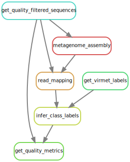

# Characterizing undetermined sequences from metagenomic sequencing
> Snakemake Workflow of Master's Thesis

## Setup

### Sequencing Data
*Note: The sequencing data is not in this repository as it contains sensitive data.*  

Prepare a folder containing the compressed raw- and unclassified sequencing files (`*.fastq.gz`) for each sample which should be analysed. Creating a symbolic link instead of copying the files is also possible.  

## Rules
The workflow is divided in different steps, also called rules in Snakemake.

To visualise the rules, a directed acyclic graph (DAG) can be written with the following command:

`snakemake --rulegraph quality_measures/1000580287-AR-RNA_classified-reads.json | dot -Tsvg > dag.svg`

### Get classified sequences
Since there is no one file containing all classified sequences of VirMet, it needs to be created first.  
There are however files containing all raw sequences and all unclassified sequences (prepared in section [Sequencing Data](sequencing-data)). It is therefore possible to get the classified sequences as follows:  

raw sequences - sequences removed by qc - unclassified sequences = classified sequences  

Next to some intermediate temporary files (which are deleted after finishing this rule) the only output is a compressed fastq file with the ending `*_classified-reads.fastq.gz` which contains all classified sequencing reads of each sample.

### Get quality measures
The tool fastp is used to get multiple quality measures of the unclassified and classified reads separate for each sample. The output is written to a json and html file in the `quality_measures/` folder.

## Usage example
There are different ways to execute parts or the whole snakemake workflow (see [Snakemake documentation](https://snakemake.readthedocs.io/en/stable/)).  
Described here is an example to run the full workflow of one sample.

`snakemake --cores 8 quality_measures/1000580287-AR-RNA_classified-reads.json`
